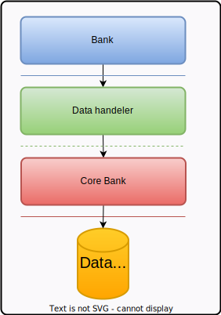

# [**(OOBS)** -> Object Oriented Bank System.](../../README.md)

## 🎨 Project Design

### 📝 Notes

1. this design not actuall system design it just contain - flowchart represent screens flow (when the screen will display)
2. i don't make digrams because i didn't learn it yet, and to focus on code track 

### 📐 Project Architecture
> using 3-tier archeticture.

 Bank app screen flowchart"/>

### 📉 Screens flowcharts

#### Bank App screens flowchart
 Bank app screen flowchart"/>

#### ATM App screens flowchart
 ATM app screen flowchart"/>

#### Data acces layer architicture
 Bank app screen flowchart"/>

